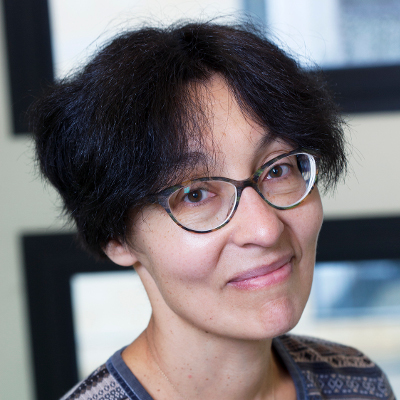
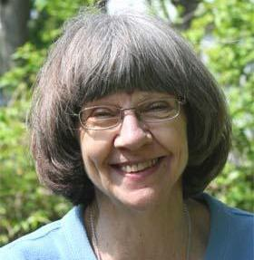
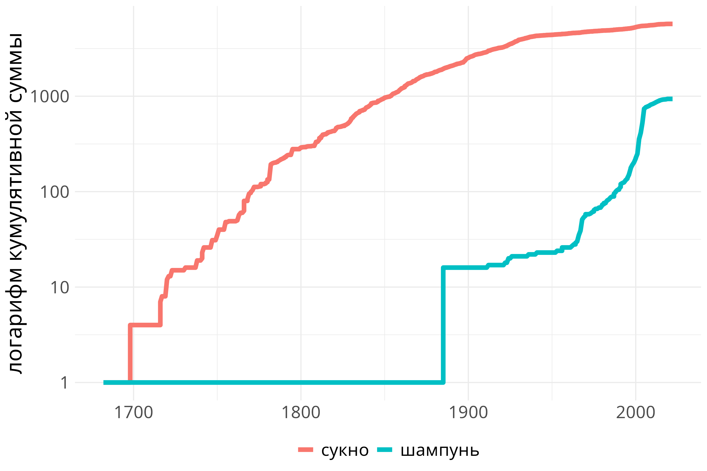
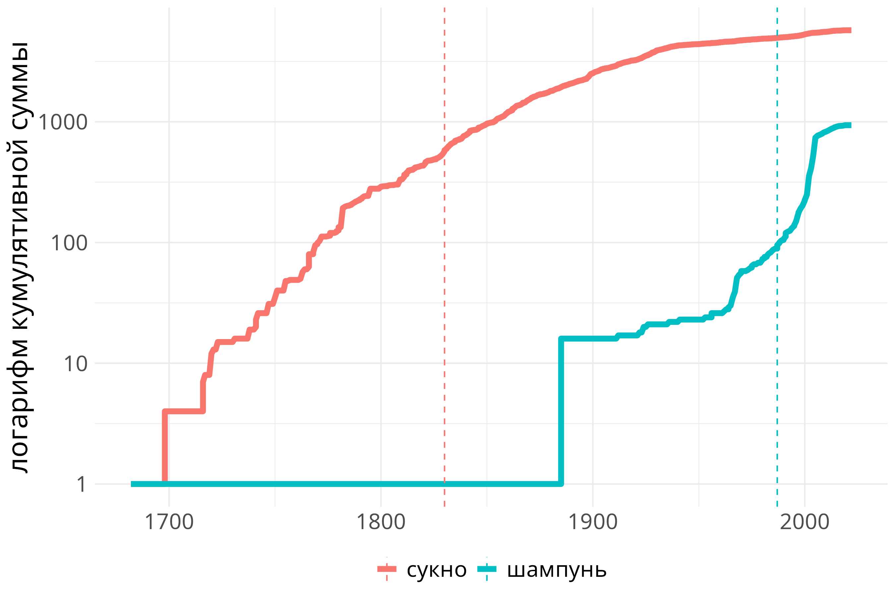

```{r}
#| include: false

library(tidyverse)
# setwd("/home/agricolamz/work/materials/2026.01.30_about_lab_and_its_projects")
```


# О лаборатории

## Международная лаборатория языковой конвергенции

- Открыта в 2017 году

```{r}
#| out-width: 85%
#| layout-ncol: 2
#| fig-subcap:
#|   - Н. Р. Добрушина
#|   - Дж. Николс



```

Оба исследователя специализируются на славянских языках и языках Кавказа, а также лингвистической типологии

## Ресурсы лаборатории

### У истоков проекта

- Многолетние социолингвистические поездки в Дагестан
- Несколько диалектных экспедиций в Устьянский район
- Онлайн ресурсы, появившиеся в результате:
    - [Корпус дагестанского русского](https://parasolcorpus.org/dagrus/)
    - [Корпус устьянских говоров](https://www.parasolcorpus.org/Pushkino/login.php)
    - ... другие диалектные и билингвальные корпуса

\pause

### Сейчас

```{r}
read_tsv("/home/agricolamz/work/bureaucracy/linguistic_convergency/LABsite_qmd/data.tsv") |> 
  filter(name != "Yakut-Russian Code-Switching Corpus",
         is.na(ignore)) ->
  resources_data
  
resources_data |>
  distinct(name, type, subtype) |> 
  filter(type == "corpus") |> 
  count(subtype) ->
  stats

bilingual <- stats |> filter(subtype == "bilingual") |> pull(n)
dialect <- stats |> filter(subtype == "dialectal") |> pull(n)
minority <- stats |> filter(subtype == "minority") |> pull(n)

resources_data |>
  distinct(name, type, subtype) |> 
  filter(type == "dictionary") |> 
  distinct(name) |> 
  nrow() ->
  dictionaries

resources_data |>
  distinct(name, type, subtype) |> 
  filter(type == "database") |> 
  distinct(name) |> 
  nrow() ->
  databases
```

- <https://lingconlab.ru/>
- `r dialect` диалектных корпусов
- `r bilingual` билингвальных корпусов
- `r minority` корпусов языков России
- `r dictionaries` словарей языков России
- `r databases` лингвистических баз данных

\pause

[И мы ищем людей, которые бы все это поддерживали!](https://ilcl.hse.ru/vacancies)

## Наши исследования

- Исследования диалектных и нестандартных вариантов русского языка
- Документация и исследования языков Кавказа
- Ассирийские исследования
- Типологические и микротипологические исследования
- Есть потенциал для исследований по компьютерной лингвистике

# Диалектные и нестандартные варианты русского языка

## Стратегии по производству корпуса

- Чаще всего мы не собирали корпуса, а заключали договор с теми, кто его собирал, чтобы подготовить разметку:
  - в формате `.TextGrid` или `.eaf`;
  - на литературном русском. \pause
- В результате:
  - в поисковом запросе мы найдем нечто общее вне зависимости от фонетических, дискурсивных и морфсинтаксических особенностей;
  - будет работать NLP для литературного русского. \pause
- Недавно мы опубликовали три копруса, которые были сделаны по-другому: 
  - исследователь из лаборатории собирает аудио
  - запускаем модель распознавания речи (`whisper`)
  - студенты проверяют работу модели в качестве практики
  - сотрудники лаборатории проверяют после студентов

## Что делать со всеми этими корпусами?

- ожидания: серия связанных исследований с похожей методологией квантитативного моделирования вариативности появления нестандартных форм
- реальность: очень сложно найти теоретически осмысленное объединение для билингвального и диалектного материала \pause
- В результате мы опубликовали ряд исследований, разделяя
  - билингвальное [@grishanova2025; @naccarato2025nonstandard; @yakovleva2025; @yakovleva2025preposition]
  - и диалектное [@ermolova_moroz_2024; @zemicheva2025variativnost]
- Ход таких исследований:
  - выбрать лингвистический признак
  - автоматически извлечь все контексты, используя морфологическую (`mystem`) и синтаксическую (`udpipe`) разметки
  - переслушать в случаях, когда есть основания не доверять разметке (например, модель может вставить предлог)
  - статистически моделировать вероятность появление нестандартной формы в зависимости от лингвистических и социолингвистических параметров

## Что делать со всеми этими корпусами?

- ожидания: серия связанных исследований с похожей методологией квантитативного моделирования вариативности появления нестандартных форм
- в качестве основы надо брать нечто, что вариативно уже в литературном русском
    - ударение (н`\'{а}`{=latex} голову vs. на г`\'{о}`{=latex}лову; забр`\'{а}`{=latex}ла vs. забрал`\'{а}`{=latex})
    - интонация
    - ...
- Но все равно объяснения будут носить разный характер:
  - диалектная вариативность будет объясняться процессами в истории русского языка, хотя и можно пытаться измерить степень влияния литературного варианта
  - билингвальная вариативность будет объясняться борьбой эффектов влияния L1 и неидельаного освоения
  
## Частотность как переменная

- В [@naccarato2025nonstandard] мы обнаружили, что нестандартных форм в конструкциях с числительными меньше, если сочетание имени и числительного частотно (*два года* vs. *два канделябра*).
- Данный эффект не был статистически значим в исследованиях выпадения предлога [@grishanova2025; @yakovleva2025], мы обнаружили, что значимым фактором является фонетика и социолингвистика.
- Несмотря на это, стоит всегда иметь это в виду и API НКРЯ теперь значительно облегчает определение частотности не только отдельного слова, но и целой конструкции или даже группы конструкций, а также позволяет анализировать разбивку частотности по годам. \pause
- (Если кому-то нужно, вот [мой скрипт](https://gist.github.com/agricolamz/96a610fd3e029350b2f814c13f92823d) для обработки запросов API НКРЯ на R.)

## Частотность как переменная

В одном проекте мы анализируем заимствования из русского языка в аваро-андийских языках. Мы ожидаем, что поздние заимствования будут меньше фонологически адаптироваться по сравнению со старыми:

- sːukuna 'сукно' (годоберинский, [@saidova2006])
- ʃampun 'шампунь'(годоберинский, [@saidova2006])

Но как же нам разделить слова на старые и новые? 

- Есть словарь советской лексики [@mokienko1998]\pause, он покрывает 21% (239 из 1345) наших данных \pause
- Можно использовать частотность из НКРЯ!
  - мы выкачиваем разбивку по годам из НКРЯ
  - считаем кумулятивную сумму
  - выбираем пороговое значение

## Частотность как переменная

```{r}
#| eval: false

read_csv("data/sukno_shampun.csv") |> 
  arrange(query, year) |> 
  group_by(query) |> 
  mutate(cumsum_count = cumsum(count)+1,
         cumsum_doc_count = cumsum(doc_count),
         total_count = max(cumsum_count),
         total_doc_count = max(cumsum_doc_count),
         year = str_extract(year, "\\d{4}") |> as.double()) |> 
  ggplot(aes(year, cumsum_count, color = query))+
  geom_line(linewidth = 2)+
  scale_y_log10()+
  labs(x = NULL, y = "логарифм кумулятивной суммы", color = NULL)+
  theme_minimal()+
  theme(legend.position = "bottom", text = element_text(size = 20)) ->
  p1

ggsave(filename = "images/03_shampoo_sukno1.png", plot = p1, bg = "white", width = 9, height = 6)
```

```{r}
#| out-width: 100%

```

\pause

Можно использовать не абсолютн. частотность, а количество текстов

## Частотность как переменная

```{r}
#| eval: false

read_csv("data/sukno_shampun.csv") |> 
  arrange(query, year) |> 
  group_by(query) |> 
  mutate(cumsum_count = cumsum(count)+1,
         cumsum_doc_count = cumsum(doc_count),
         total_count = max(cumsum_count),
         total_doc_count = max(cumsum_doc_count),
         ratio = cumsum_count/total_count,
         year = str_extract(year, "\\d{4}") |> as.double()) |> 
  filter(ratio > 0.1) |> 
  slice_min(year) |> 
  slice_head(n = 1) |> 
  select(query, year) |> 
  rename(threshold_year = year) ->
  threshold

read_csv("data/sukno_shampun.csv") |> 
  arrange(query, year) |> 
  group_by(query) |> 
  mutate(cumsum_count = cumsum(count)+1,
         year = str_extract(year, "\\d{4}") |> as.double()) |> 
  ggplot(aes(year, cumsum_count, color = query))+
  geom_line(linewidth = 2)+
  geom_vline(aes(xintercept = threshold_year, color = query), 
             linetype = 2,
             data = threshold)+
  scale_y_log10()+
  labs(x = NULL, y = "логарифм кумулятивной суммы", color = NULL)+
  theme_minimal()+
  theme(legend.position = "bottom", text = element_text(size = 20)) ->
  p2

ggsave(filename = "images/03_shampoo_sukno2.png", plot = p2, bg = "white", width = 9, height = 6)
```

```{r}
#| out-width: 100%

```

Пороговое значение --- 10%.

# Проекты по исследованию языков Кавказа

## Typological Atlas of the Languages of Daghestan

WALS, но для языков Дагестана.

- <https://lingconlab.ru/tald/>
- DEV-версия <https://lingconlab.github.io/TALD>
- [contributor manual](https://lingconlab.github.io/TALD_manual/)

- более 70 глав (фонология, морфология, лексика, синтаксис, дискурс) и несколько видов карт
- открытые данные, покрытые тестами

## Дигитализация нахско-дагестанских словарей

Большой проект лаборатории начался с лексикографической базы данных андийских языков:

- [@moroz2025]:
  - лемма
  - представление в IPA;
  - морфологические особенности (например, множественное число, класс или глагольные формы);
  - части речи;
  - толкование;
  - отдельные значения леммы;
  - примеры;
  - предполагаемый источник заимствования;
  - когнатность на основе [@mudrak2020].

Сейчас база данных пополняется аварским, нахскими и цезскими языками.

## Рутульский проект

Проект начинался как проект по описанию кининского говора рутульского языка (планируется издать сборник статей).

В 2022 году был собран материал в 12 селах и оформлен [в атлас](https://lingconlab.github.io/rutul_dialectology/), в котором более чем 400 признаков. Анкеты на разные домены:

- стословники (~ Swadesh 200 / CoBL);
- дополнительная лексика;
- фонетика и фонология;
- морфология;
- синтаксис;
- дискурсивные формулы.

Кроме того, был составлен электронный словарь (версия [один](https://lingconlab.github.io/kina-rutul-dict/), версия [два](https://zhaaabka.github.io/kina-rutul-dict/index.html)). Каждый вход содержит  словоизменительную информацию, список возможных значений и сентенциальные примеры для каждого значения.

## The Caucasian languages. An International Handbook

В издательстве De Gruyter Mouton запланирован сборник «The Caucasian languages. An International Handbook» в трех томах под редакцией Т. А. Майсака, Ю. Б. Корякова, С. Кея, Ю. А. Ландера:

- Nakh-Daghestanian languages: Nakh, Avar-Andic and Tsezic
- Nakh-Daghestanian languages: Lak, Dargwa, Lezgic and Khinalug
- West Caucasian languages. Kartvelian languages

Все статьи имеют сходную структуру.

## Векторный поиск по сборнику

Статьи из сборника «The Caucasian languages. An International Handbook» достаточно легко использовать как базу данных для векторного поиска.

### Посредственный поисковик

- представить тексты в едином формате (`.docx` -> markdown)
- разделить тексты на небольшие пересекающиеся кусочки
- векторизовать полученные фрагменты
- векторизовать запрос и найти ближайшие на основе косинусного расстояния

### Генерация, дополненная поиском (aka RAG)

- дать результаты запроса LLM для обобщения

## Векторный поиск по лингвистическим аннотациям

Мы в какой-то момент собирали базу данных аннотаций статей по лингвистике.

- англоязычные (79 тысяч) 626012700078-5
- русскоязычные (19 тысяч) 626012700079-2

## {}

\vfill
\centering \huge
\alert{Спасибо за внимание!}
\vfill

# Ссылки на литературу